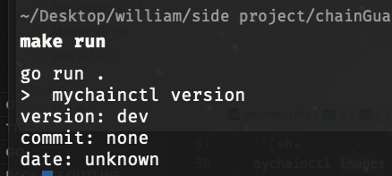
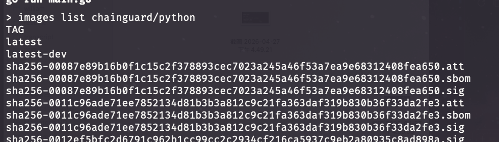
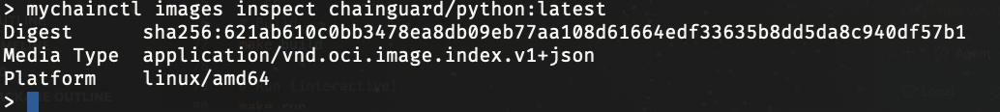

# mychainctl

mychainctl is a small CLI that mimics parts of Chainguard chainctl.
It focuses on chainctl images workflows and talks directly to cgr.dev.

## Features

- `version`: print CLI version metadata
- `images list <repository>`: list image tags for a repo
- `images inspect <image:tag>`: inspect image digest, media type, and platform
- Output formats: table (default) or JSON via `--output`/`-o`

## Tech Stack

- Go 1.21+
- spf13/cobra
- google/go-containerregistry (ggcr)
- text/tabwriter
- encoding/json

## Target Registry

- cgr.dev (Chainguard public OCI registry)

## Commands

```sh
# Version
mychainctl version

# List tags
mychainctl images list chainguard/python

# Inspect image
mychainctl images inspect chainguard/python:latest

# JSON output
mychainctl images list chainguard/python -o json
```

## Screenshots

- `version`

  Command:

  ```sh
  mychainctl version
  ```

  

- `images list`

  Command:

  ```sh
  mychainctl images list chainguard/python
  ```

  

- `images inspect`

  Command:

  ```sh
  mychainctl images inspect chainguard/python:latest
  ```

  

## Run

```sh
# Build
make build

# Run (interactive)
make run
```

## Notes

- The CLI starts in interactive mode. Type commands without the `mychainctl` prefix and use `exit`/`quit` to leave.
